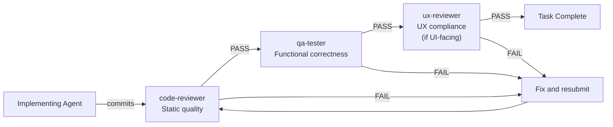

**Date:** 2026-03-02

OrqaStudio™ uses an agentic development model: one orchestrator coordinates, and specialized subagents implement. This page defines the team structure, each agent's role, the skills available to them, and how review gates work.

---

## Team Model

| Role | Participant | Responsibilities |
|------|-------------|-----------------|
| **Product Manager** | User (human) | Defines vision, pillars, priorities. Approves feature scope. Makes decisions when product principles conflict. |
| **Tech Lead** | User (human) | Approves implementation plans before coding begins. Reviews architecture decisions. Provides technical oversight. Final authority on technical approach. |
| **Scrum Master / Dev Lead** | Orchestrator (main AI session) | Reads task artifacts, creates worktrees, delegates to agents, gates on DoR/DoD, merges completed work, runs post-merge verification. |
| **Implementation Team** | Specialized agents | Implement delegated tasks end-to-end. Load skills. Run quality checks. Report results. |

The Product Manager and Tech Lead roles may be filled by the same person if they have the skillset. Both are human gates — no implementation proceeds without explicit user approval of the plan.

The orchestrator does NOT implement code directly. Its job is coordination, delegation, and gating. See Orchestration for the full orchestrator protocol.

---

## Agent Directory

All 7 universal roles are defined in `.orqa/process/agents/`. Each role is invoked via the Task tool with the appropriate `subagent_type`, and domain capability is loaded via skills at delegation time (see [AD-029](AD-029)).

| Role | Purpose | Tier 1 Skills | When to Use |
|------|---------|---------------|-------------|
| **Orchestrator** | Coordinates work, enforces process, manages governance | `orqa-code-search`, `composability`, `planning`, `governance-maintenance` | Session coordination, task lifecycle, governance artifact management |
| **Researcher** | Investigates questions, gathers information, analyses findings | `orqa-code-search`, `composability`, `planning` | Before planning, when understanding is needed; produces research documents |
| **Planner** | Designs approaches, evaluates tradeoffs, maps dependencies | `orqa-code-search`, `composability`, `planning`, `architecture` | Before implementation; cross-boundary features; produces implementation plans in epics |
| **Implementer** | Does the work — code, deliverables, whatever "work" means | `orqa-code-search`, `composability` + domain skills loaded by orchestrator | Rust backend, Svelte frontend, database, build, refactoring |
| **Reviewer** | Checks quality, compliance, correctness | `orqa-code-search`, `composability` + review skills loaded by orchestrator | Code quality, QA, UX compliance, security audits |
| **Writer** | Creates documentation, specifications, communications | `orqa-code-search`, `composability`, `planning` | Architecture docs, IPC contracts, component specs, process documentation |
| **Designer** | Designs experiences, interfaces, and structures | `orqa-code-search`, `composability`, `svelte5-best-practices`, `tailwind-design-system` | UI components, styling, visual polish, design system |

Orchestrator-injected Tier 2 skills narrow the Implementer and Reviewer roles to specific domains. See the delegation guide above and [AD-029](AD-029) for the full skill-loading model.

---

## Skill Directory

Skills are domain-specific instruction sets stored in `.orqa/process/skills/`. They follow the open [Agent Skills](https://agentskills.io) standard and must be portable — no OrqaStudio-specific architectural rules in skills.

| Skill | Source | Domain | Loaded By |
|-------|--------|--------|-----------|
| `chunkhound` | Custom | Semantic code search: search_regex, search_semantic, code_research | ALL agents |
| `planning` | Custom | Discuss-Agree-Plan-Approve-Implement-Verify methodology | orchestrator, planner, researcher, writer |
| `skills-maintenance` | Custom | skills.sh CLI, skill lifecycle, portability rules, audit protocol | orchestrator (governance work) |
| `architecture` | Custom | ADR pattern, data flow mapping, architectural violations | Planner, Writer |
| `svelte5-best-practices` | skills.sh registry | Svelte 5 runes ($state, $derived, $effect), component patterns | Implementer (frontend), Designer, Reviewer |
| `typescript-advanced-types` | skills.sh registry | Strict TypeScript, readonly types, string literal unions | Implementer (frontend), Reviewer |
| `tailwind-design-system` | skills.sh registry | Tailwind CSS utilities, theme variables, design tokens | Implementer (frontend), Designer, Reviewer (UX) |
| `rust-async-patterns` | skills.sh registry | Rust async/await, tokio, error handling, lifetimes | Implementer (backend), Reviewer |
| `tauri-v2` | skills.sh registry | Tauri v2 commands, Channel&lt;T&gt;, plugins, security model | Implementer (backend), Planner, Reviewer |

For full provenance and date-added information, see Skills Log.

---

## Review Gates

Every task passes through independent review agents before it is marked complete. The implementing agent does not self-certify.

| Reviewer | Evaluates |
|----------|-----------|
| `code-reviewer` | clippy/rustfmt/ESLint/svelte-check zero errors; no stubs; 80%+ coverage; doc layer compliance; DoD code items |
| `qa-tester` | End-to-end functional correctness from a user perspective; smoke test; DoD smoke test items |
| `ux-reviewer` | Labels match UI specs in `.orqa/documentation/ui/`; all component states handled; shared components used; no jargon in UI; DoD UI items |

Review failures generate entries in Implementation Lessons. The orchestrator promotes recurring failures to rules or standards.

---

## Content Ownership

Each layer of the governance system owns a specific type of content. For the full framework, see Content Governance.

| Layer | Owns |
|-------|------|
| `.orqa/documentation/` | Standards, IPC contracts, architecture decisions — source of truth |
| `.orqa/process/agents/` | Process: how agents work, what to read, when to delegate |
| `.orqa/process/skills/` | Technology patterns — portable, no OrqaStudio-specific rules |
| `.orqa/process/rules/` | Behavioral enforcement — applies to all agents automatically |
| `.orqa/process/hooks/` | Lifecycle hooks — shell scripts triggered by lifecycle events (session start, stop, pre-commit) |

---

## Related Documents

- Orchestration -- Orchestrator responsibilities and context discipline
- Workflow -- Task lifecycle from start to complete
- Content Governance -- The six-layer ownership model
- Skills Log -- Full skill inventory with provenance and dates
- Definition of Ready -- What must be true before implementation starts
- Definition of Done -- What must be true before a task is marked complete
