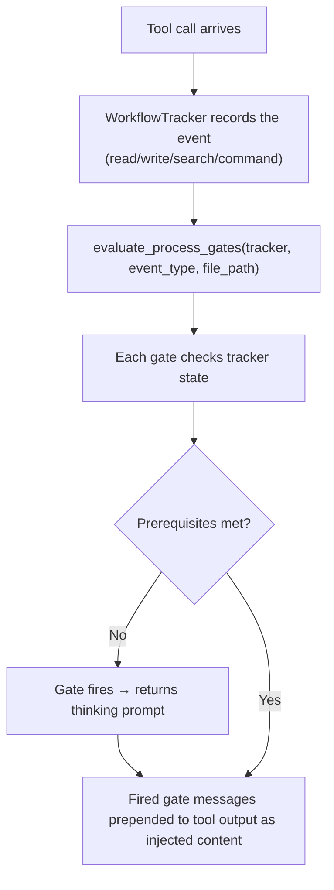
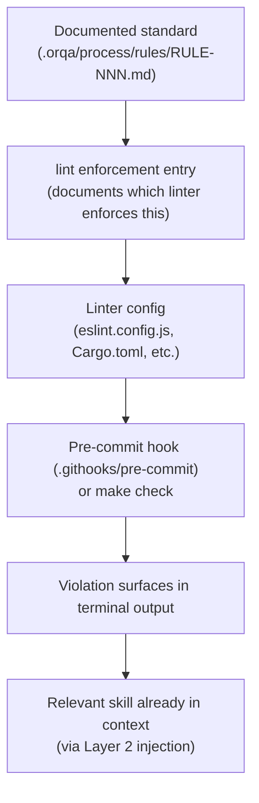
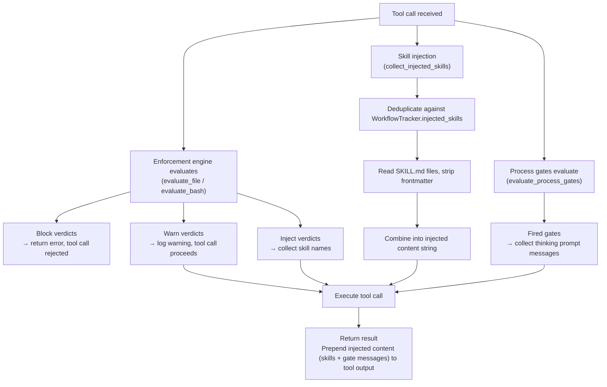

OrqaStudio's enforcement system ensures agents follow the structured thinking process — understand, plan, document, implement, review, learn — at every stage of work. It operates across four layers, each addressing a different enforcement concern.

The system runs in two contexts: the **Rust backend** (native enforcement engine within the Tauri app) and the **CLI plugin** (JavaScript hooks for Claude Code compatibility). Both implement the same logic from the same rule frontmatter.

---

## Single Source of Truth

Rule files in `.orqa/process/rules/` are the single source of truth for:

1. **Human-readable behavioral constraints** — injected into agent context as rule text
2. **Machine-readable enforcement entries** — YAML frontmatter declaring patterns, actions, and skill injections

There is no separate enforcement configuration file. Adding an enforcement entry to a rule's frontmatter activates it in both the app and in the CLI plugin.

---

## Rule Frontmatter Schema

```yaml
---
enforcement:
  - event: file | bash | scan | lint | prompt
    action: block | warn | inject
    conditions:                           # file/scan events: AND-matched conditions
      - field: file_path | new_text | content
        pattern: "regex pattern"
    pattern: "regex pattern"              # bash/prompt events: single pattern
    paths:                                # file events: glob patterns restricting scope
      - "backend/src-tauri/**/*.rs"
    scope: "glob pattern"                 # scan events: files to scan
    skills:                               # inject action: skill names to load
      - skill-name
    message: "Human-readable message"     # Required: displayed when entry matches
---
```

### Event Types

| Event | Trigger | Evaluation Target |
|-------|---------|-------------------|
| `file` | File write or edit tool call | File path + new content, via `conditions` array |
| `bash` | Bash tool call | Command string, via `pattern` field |
| `scan` | On-demand governance scan | Project files matching `scope` glob, via `conditions` |
| `lint` | Declarative only | Not executed by the engine — documents linter delegation |
| `prompt` | User prompt submission (CLI only) | User message text, via keyword matching or embedding similarity |

### Action Types

| Action | Behavior | Use Case |
|--------|----------|----------|
| `block` | Rejects the tool call, returns error to the model | Hard constraints (no `unwrap()`, no `--no-verify`) |
| `warn` | Allows the tool call, records a warning | Soft constraints (force push, large file writes) |
| `inject` | Non-blocking, injects skill content into agent context | Knowledge injection (load domain skills when touching specific code) |

### Condition Fields

| Field | Used In | Matches Against |
|-------|---------|-----------------|
| `file_path` | `file` events | The path of the file being written |
| `new_text` | `file` events | The content being written to the file |
| `content` | `scan` events | Each line of scanned file content |

All conditions within an entry are AND-matched — every condition must match for the entry to trigger.

---

## Layer 1: Process Gates

Process gates enforce the structured thinking sequence at workflow transitions. They fire when an agent attempts actions without completing prerequisite thinking steps.

### WorkflowTracker

The `WorkflowTracker` (`backend/src-tauri/src/domain/workflow_tracker.rs`) tracks session-level events:

| Event Category | Tracked Data | Purpose |
|----------------|-------------|---------|
| Files read | Paths of all files read | Detect whether research was done |
| Files written | Paths of all files written | Detect code writes vs governance writes |
| Searches | Count of search tool calls | Detect codebase exploration |
| Docs consulted | Reads from `.orqa/documentation/` | Detect documentation review |
| Planning consulted | Reads from `.orqa/delivery/` | Detect planning artifact review |
| Skills loaded | Names of loaded skills | Detect skill loading |
| Commands run | Bash commands executed | Detect `make check`/`make test` runs |
| Verification run | Boolean flag | Set when `make check`/`make test` detected |
| Lessons checked | Boolean flag | Set when `.orqa/process/lessons/` read |
| Injected skills | Deduplication set | Prevent injecting the same skill twice per session |

The tracker is stored in `AppState` behind a `Mutex<WorkflowTracker>` and shared across all tool execution handlers.

### Gate Definitions

Gates are evaluated by `evaluate_process_gates()` (`backend/src-tauri/src/domain/process_gates.rs`). Each gate returns a `GateResult` with a thinking prompt message when fired.

| Gate | Fires When | Checks | Injected Prompt |
|------|-----------|--------|-----------------|
| **understand-first** | First code write in session | No files read, no searches, no docs consulted | "What is the system? What are the boundaries? What depends on this?" |
| **docs-before-code** | Code write without reading documentation | No `.orqa/documentation/` files read | "What documentation defines this area? Read the governing docs first." |
| **plan-before-build** | Code write without planning context | No `.orqa/delivery/` files read | "What's the plan? Read the epic and task context before building." |
| **evidence-before-done** | Session ending (stop event) | No `make check`/`make test` run + code was written | "Show evidence. Run verification. What would a user see?" |
| **learn-after-doing** | Session ending (stop event) | No lessons checked + code was written | "What was unexpected? Check lessons. Should we know something for next time?" |

Gates fire at most once per trigger — the tracker records when each gate has already fired to prevent repeated injection.

### Evaluation Flow



---

## Layer 2: Knowledge Injection

When agents touch specific code areas, the enforcement system automatically injects relevant domain knowledge as skill content.

### How It Works

1. Rule frontmatter declares `action: inject` entries with `conditions` matching file paths and `skills` listing skill names
2. When a file write matches, the `Verdict` carries the skill names
3. The tool executor reads each skill's `SKILL.md` from `.orqa/process/skills/{name}/SKILL.md`
4. YAML frontmatter is stripped; the skill body content is returned
5. Content is deduplicated per session via the `WorkflowTracker`'s `injected_skills` set
6. The combined skill content is prepended to the tool output

### Injection Table (Current Entries)

| Path Pattern | Injected Skills | Purpose |
|-------------|----------------|---------|
| `backend/src-tauri/src/domain/**/*.rs` | `orqa-domain-services`, `orqa-error-composition` | Domain logic patterns |
| `backend/src-tauri/src/commands/**/*.rs` | `orqa-ipc-patterns`, `orqa-error-composition` | IPC boundary discipline |
| `backend/src-tauri/src/repo/**/*.rs` | `orqa-repository-pattern` | Data access patterns |
| `sidecar/src/**` | `orqa-streaming` | Streaming pipeline protocol |
| `ui/src/lib/components/**/*.svelte` | `component-extraction`, `svelte5-best-practices` | Component purity |
| `ui/src/lib/stores/**/*.svelte.ts` | `orqa-store-patterns`, `orqa-store-orchestration` | Reactive state patterns |
| `.orqa/**` | `orqa-governance`, `orqa-documentation` | Artifact consistency |

### Deduplication

Both the Rust engine and CLI plugin track which skills have been injected in the current session:

- **Rust**: `WorkflowTracker.injected_skills: HashSet<String>` — `mark_skill_injected()` returns `true` only for newly-added skills
- **CLI plugin**: `tmp/.injected-skills.json` — JSON array persisted to disk per session, checked before each injection

A skill is only injected once per session, regardless of how many matching file writes occur.

### Skill Content Format

When skills are injected, they are formatted as:

```text
[Enforcement: the following skills have been loaded for context]

## Skill: {skill-name}

{stripped SKILL.md content}

[End of injected skills]

{original tool output}
```

---

## Layer 3: Tooling Ecosystem Delegation

OrqaStudio does not replicate linters — it ensures the right linters are configured and triggered to match documented standards.

### The `lint` Event Type

The `lint` event type in enforcement entries is **declarative only**. It is never evaluated by the engine at runtime. Its purpose is to document which external tool enforces a given standard, creating a traceable chain from rule → linter config → hook trigger.

```yaml
enforcement:
  - event: lint
    action: warn
    pattern: "clippy::unwrap_used"
    message: "Enforced by clippy pedantic lint group"
```

### Documented Linter Delegation

| Standard | Linter | Config Location | Hook Trigger |
|----------|--------|-----------------|--------------|
| No `unwrap()`/`expect()` in production | `cargo clippy` (pedantic) | `Cargo.toml` lint config | Pre-commit + `make check` |
| Rust formatting | `rustfmt` | `rustfmt.toml` | Pre-commit |
| No `any` types | ESLint `@typescript-eslint/no-explicit-any` | `eslint.config.js` | Pre-commit + `make check` |
| No Svelte 4 patterns | ESLint `svelte/no-reactive-declaration` | `eslint.config.js` | Pre-commit |
| Strict TypeScript in Svelte | `svelte-check --tsconfig tsconfig.json` | `tsconfig.json` | Pre-commit + `make check` |
| Artifact frontmatter validation | `.githooks/validate-schema.mjs` | Schema files per artifact type | Pre-commit |
| Function size limits | `clippy::too_many_lines` | `Cargo.toml` lint config | `make check` |

### The Full Chain



---

## Layer 4: Prompt-Based Skill Injection

Beyond path-based injection (Layer 2), OrqaStudio interprets the user's **prompt** to determine what knowledge is needed before work begins.

### CLI Implementation (Plugin)

The CLI plugin uses keyword-based intent classification via `prompt-injector.mjs`:

1. The `UserPromptSubmit` hook fires when the user sends a message
2. The prompt is classified against an intent map (13 categories)
3. Matching skills are collected and deduplicated against prior injections
4. Skill content is returned as `systemMessage` in the hook response

**Intent Map (Current Categories):**

| Intent | Keywords | Injected Skills |
|--------|----------|----------------|
| IPC boundary work | tauri command, ipc, invoke, #[tauri::command] | `orqa-ipc-patterns`, `orqa-error-composition` |
| Store architecture | store, reactive, $state, $derived, $effect, rune | `orqa-store-patterns`, `orqa-store-orchestration` |
| Component work | component, svelte component, ui component | `component-extraction`, `svelte5-best-practices` |
| Domain logic | domain, domain service, business logic | `orqa-domain-services`, `orqa-error-composition` |
| Data access | repository, database, sqlite, migration, query | `orqa-repository-pattern` |
| Streaming pipeline | stream, sidecar, ndjson, provider, streaming | `orqa-streaming` |
| Planning phase | plan, approach, design, architect, tradeoff | `planning`, `architecture`, `systems-thinking` |
| Review phase | review, check, audit, verify, quality | `code-quality-review`, `qa-verification` |
| Diagnostic work | debug, fix, broken, error, failing, crash, bug | `diagnostic-methodology`, `systems-thinking` |
| Testing work | test, testing, vitest, cargo test, coverage | `orqa-testing`, `test-engineering` |
| Code search | search, find, where is, locate | `orqa-code-search` |
| Governance work | governance, rule, skill, artifact, enforcement | `orqa-governance`, `orqa-documentation` |
| Refactoring | refactor, restructur, reorganiz, extract | `restructuring-methodology`, `systems-thinking` |

### App Implementation (Native)

The app uses semantic similarity via the `SkillInjector` (`backend/src-tauri/src/domain/skill_injector.rs`):

1. On startup, all skills are discovered from `.orqa/process/skills/*/SKILL.md`
2. Each skill's `description:` frontmatter field is extracted
3. Descriptions are embedded using the ONNX embedder (bge-small-en-v1.5, 384-dim vectors)
4. When a user prompt arrives, it is embedded and compared against all skill embeddings
5. Skills with cosine similarity above the threshold (default 0.3) are returned, sorted by score
6. Top-N results (default 3) are injected into the agent context

**Key Functions:**

| Function | Purpose |
|----------|---------|
| `SkillInjector::new(project_dir, embedder)` | Discover skills, embed descriptions, cache results |
| `SkillInjector::match_prompt(embedding, top_n, threshold)` | Find top-N skills by cosine similarity |
| `cosine_similarity(a, b)` | Dot product / (norm_a * norm_b), returns 0.0 for zero/mismatched vectors |
| `discover_skill_descriptions(skills_dir)` | Walk skill directories, extract `description:` from YAML |

---

## Rust Module Structure

```text
backend/src-tauri/src/domain/
  enforcement.rs            -- Type definitions: EventType, RuleAction, EnforcementEntry,
                               EnforcementRule, Verdict, ScanFinding, Condition
  enforcement_parser.rs     -- YAML frontmatter parsing: split_frontmatter(),
                               parse_rule_content(), parse_entry()
  enforcement_engine.rs     -- EnforcementEngine: compile entries, evaluate_file(),
                               evaluate_bash(), scan()
  workflow_tracker.rs       -- WorkflowTracker: session event tracking, skill dedup
  process_gates.rs          -- evaluate_process_gates(): five gate evaluations
  skill_injector.rs         -- SkillInjector: ONNX embedding + cosine similarity matching
  tool_executor.rs          -- Tool execution with enforcement integration (non-streaming)
  stream_loop.rs            -- Streaming tool execution with enforcement integration
```

### Supporting Modules

```text
backend/src-tauri/src/
  repo/
    enforcement_rules_repo.rs -- load_rules(): reads .orqa/process/rules/*.md from disk
  state.rs                    -- AppState: holds EnforcementEngine, WorkflowTracker,
                                 SkillInjector behind Mutex
  search/
    embedder.rs               -- ONNX Runtime embedder used by SkillInjector
```

---

## CLI Plugin Structure

```text
.orqa/plugins/orqastudio-claude-plugin/
  hooks/
    hooks.json                    -- Hook registration (PreToolUse, Stop, UserPromptSubmit)
    scripts/
      rule-engine.mjs             -- Enforcement engine: loads rules, evaluates patterns,
                                     handles inject/block/warn actions with skill reading
      prompt-injector.mjs         -- Prompt-based skill injection: intent classification,
                                     skill reading, session deduplication
```

### Plugin Hook Registration

| Hook Event | Script | Purpose |
|-----------|--------|---------|
| `PreToolUse` | `rule-engine.mjs` | Evaluate enforcement entries on file/bash tool calls |
| `Stop` | `rule-engine.mjs` | Evaluate process gates at turn end |
| `UserPromptSubmit` | `prompt-injector.mjs` | Classify prompt intent and inject skills |

---

## Enforcement Result Flow

Both streaming and non-streaming tool execution follow the same pattern:



The `EnforcementResult` struct carries both components:

```rust
pub struct EnforcementResult {
    pub block_message: Option<String>,     // Set when action is block
    pub injected_content: Option<String>,  // Combined skills + gate messages
}
```

---

## Testing

The enforcement system has comprehensive test coverage:

| Module | Test Count | What's Tested |
|--------|-----------|---------------|
| `enforcement_engine.rs` | 15 | File/bash/scan evaluation, inject/block/warn verdicts, lint skipping, multi-rule matching |
| `enforcement_parser.rs` | 10 | Frontmatter splitting, entry parsing, event/action validation, condition parsing |
| `workflow_tracker.rs` | 34 | Event recording, auto-categorization, research detection, skill dedup, verification detection |
| `process_gates.rs` | 30 | All five gates, firing conditions, one-shot behavior, edge cases |
| `skill_injector.rs` | 21 | Cosine similarity, frontmatter extraction, prompt matching, threshold/top-N filtering |
| **Total** | **110** | |

---

## Related Documents

- [RULE-006](RULE-006) — Coding standards with lint enforcement entries
- [RULE-013](RULE-013) — Git workflow with `--no-verify` blocking
- [RULE-026](RULE-026) — Skill enforcement and three-tier loading model
- [EPIC-052](EPIC-052) — Structured Thinking Enforcement epic (design + implementation)
- [AD-015](AD-015) — Governance artifact format
