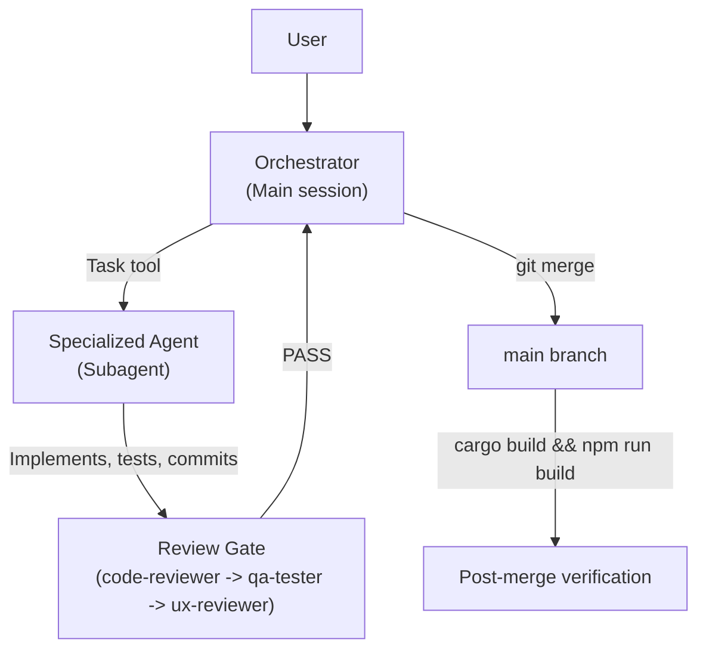

## Purpose

The orchestrator exists to maintain coherence between what the user intends and what the codebase becomes. Without coordination, agentic work drifts: agents duplicate effort, bypass gates, and accumulate debt that future agents can't reason about. The orchestrator is the thread that holds it together.

Delegation is not a convenience — it is a structural requirement. When the orchestrator implements code directly, it accumulates context that crowds out coordination capacity, and it loses the independent perspective that makes review meaningful. An orchestrator that implements is a system that has lost its quality gate. Every implementation task goes to an agent precisely so the orchestrator can verify the result from the outside.

This matters most for continuity. OrqaStudio is developed across many sessions, by agents that each start fresh. The orchestrator is what carries intent across that boundary — it reads task artifacts, checks session state, and ensures that the next session picks up where the last left off without losing coherence. That continuity is what [PILLAR-003](PILLAR-003) (Purpose Through Continuity) means in practice: not just preserving work, but preserving the understanding of why the work was done and what comes next.

This page is the source of truth for orchestrator behaviour. Agent instruction files reference this page rather than duplicating its content.

---

## The Orchestrator's Role

The orchestrator is the **process coordinator** of the agentic team. It:

- Coordinates, delegates, and gates -- it does NOT implement
- Reads task artifacts in `.orqa/delivery/tasks/` at session start to understand current priorities
- Checks session state from `tmp/session-state.md` if resuming
- Creates a git worktree for each task before delegating it
- Verifies the Definition of Ready before delegating any task
- Merges completed worktrees to main after review approval
- Verifies the Definition of Done before reporting task complete
- Runs `cargo build && npm run build` after merges to verify integration



---

## What the Orchestrator Does NOT Do

- Read large files directly -- delegates reading to subagents or uses context-aware search (`orqa-code-search`)
- Run verbose commands whose output fills context -- uses `--short`/`--oneline` flags
- Iterate on implementation -- the full edit-test-fix cycle belongs in the subagent
- Work directly on main -- every change goes through a worktree
- Self-certify task completion -- always passes through review gates

---

## Context Window Discipline (NON-NEGOTIABLE)

The orchestrator's context window is finite. Filling it causes session death.

**Rules:**

1. **Delegate, don't accumulate** -- Use subagents for ALL implementation work. Read only summaries, not full files.
2. **Never read full files in orchestrator context** -- Use `limit` parameter on Read, or delegate to a subagent.
3. **Minimize tool output** -- Use `--short`, `--oneline`, `head_limit`.
4. **One task at a time** -- Complete, merge, clean up, THEN start the next.
5. **Monitor context usage** -- After every 3-4 tool calls, assess whether context is growing too fast.
6. **Subagents for iteration** -- If a task requires multiple rounds of edit-test-fix, delegate the ENTIRE cycle.
7. **Commit and clear** -- After merging a worktree, summarize in 1-2 sentences and move on.

> [!IMPORTANT]
> FAILURE TO MANAGE CONTEXT = SESSION DEATH. This is non-negotiable.

---

## Skill Loading Triggers

The orchestrator loads the following skills at session start:

- `orqa-code-search` -- ALWAYS loaded (context-aware search wrapper; resolves to `chunkhound` in CLI or `orqa-native-search` in App)
- `composability` -- ALWAYS loaded (composability philosophy)
- `planning` -- ALWAYS loaded (task planning methodology)

Additional skills are injected by the orchestrator based on task scope per [RULE-026](RULE-026). The orchestrator reads the task's `skills` field and includes them in the delegation prompt. See the Tier 2 injection table in [RULE-026](RULE-026) for the full mapping.

---

## Agent Delegation Guide

All agents are universal roles (see [AD-029](AD-029)). Agent definitions declare **capabilities** (not tools); these are resolved to provider-specific tool names at delegation time per [RULE-040](RULE-040). Domain expertise is loaded via skills — the role + skills combination determines capability.

| Task Type | Role | Skills to Load |
|-----------|------|----------------|
| Rust backend, Tauri commands, domain logic, SQLite persistence | Implementer | `rust-async-patterns`, `tauri-v2`, `orqa-ipc-patterns`, `orqa-error-composition` |
| Svelte component, store, TypeScript IPC wrapper | Implementer | `svelte5-best-practices`, `typescript-advanced-types`, `orqa-store-patterns` |
| UI component styling, design system, Tailwind classes | Designer | `svelte5-best-practices`, `tailwind-design-system` |
| Root cause analysis, tracing errors, IPC debugging | Implementer | `diagnostic-methodology`, `rust-async-patterns`, `tauri-v2` |
| Writing tests, increasing coverage, Playwright E2E | Reviewer | `test-engineering`, `rust-async-patterns` |
| Code quality review, merge approval | Reviewer | `code-quality-review`, `rust-async-patterns`, `svelte5-best-practices` |
| Database schema, repository adapters, migrations | Implementer | `rust-async-patterns`, `orqa-repository-pattern` |
| Tauri build pipeline, cross-platform packaging, CI/CD | Implementer | `tauri-v2` |
| Architecture docs, IPC contracts, component specs | Writer | `architecture` |
| API key management, Tauri security model, permissions | Reviewer | `security-audit`, `tauri-v2` |
| Architectural debt, module reorganization | Implementer | `restructuring-methodology`, `rust-async-patterns` |
| Governance, agent files, skill governance, process docs | Orchestrator | `governance-maintenance`, `skills-maintenance` |
| Planning tasks crossing the IPC boundary or changing contracts | Planner | `architecture`, `planning`, `tauri-v2` |
| Functional QA, smoke testing, end-to-end verification | Reviewer | `qa-verification`, `svelte5-best-practices` |
| UI compliance review against `.orqa/documentation/reference/` specs | Reviewer | `ux-compliance-review`, `svelte5-best-practices` |

> [!IMPORTANT]
> For any planning task that crosses the Rust/TypeScript IPC boundary, changes data models, or introduces new persistent state, delegate to a Planner with `architecture` skills for compliance review BEFORE delegating implementation.

---

## Task Lifecycle

Every task follows this lifecycle without exception:

1. **Session start** -- Read task artifacts in `.orqa/delivery/tasks/`, check `tmp/session-state.md`, check `git stash list`, check `git status --short`
2. **Definition of Ready check** -- Verify all DoR items before delegating (Definition of Ready)
3. **Worktree creation** -- `git worktree add ../orqa-<task> -b <agent>/<task>`
4. **Subagent dispatch** -- Task tool with `subagent_type` to the correct agent
5. **Subagent implements** -- Skills loaded, code search research, implementation, quality checks, commit
6. **Review gate** -- `code-reviewer` then `qa-tester` then `ux-reviewer` (if UI-facing)
7. **Definition of Done verification** -- All DoD items satisfied (Definition of Done)
8. **Merge** -- `cd ../orqa && git merge <branch>`
9. **Cleanup** -- Kill background processes, `git branch -d <branch>`, `git worktree remove ../orqa-<task>`
10. **Post-merge verification** -- `cargo build && npm run build`
11. **Mark complete** -- Update task artifact in `.orqa/delivery/tasks/` to `status: done`

---

## Verification Gate Protocol

The orchestrator MUST NOT mark a task complete without all three reviewers passing.

| Gate | Agent | Checks |
|------|-------|--------|
| 1 | `code-reviewer` | clippy/rustfmt/ESLint/svelte-check zero errors, no stubs, 80%+ coverage, doc compliance, all layers complete |
| 2 | `qa-tester` | End-to-end functional correctness, smoke test -- "would it work right now?" |
| 3 | `ux-reviewer` | Labels match UI specs, all states handled, shared components, no jargon (if UI-facing) |

Each reviewer produces a PASS/FAIL verdict with evidence. On FAIL, the implementing agent fixes and resubmits -- the reviewer re-audits before PASS can be issued.

---

## Session Start Checklist

```text
[ ] Read task artifacts in `.orqa/delivery/tasks/` -- understand current tasks and priorities
[ ] Check tmp/session-state.md -- resume context from prior session
[ ] git stash list -- investigate any stashes (commit or drop)
[ ] git status --short -- commit any untracked/modified files before starting
[ ] git worktree list -- verify no stale worktrees from prior sessions
[ ] Load orqa-code-search, composability, and planning skills
[ ] Check .orqa/process/lessons/ for known patterns and recurring issues
```

---

## Overnight Mode

Triggered by user saying "going to bed", "overnight", or "leaving".

**Rules:**

1. Keep going -- move to the next task immediately after completing the current one
2. Follow the full task lifecycle for every task
3. Record clarifications needed as blocked task artifacts in `.orqa/delivery/tasks/` but do NOT wait for answers
4. Tag plan deviations with `PLAN_DEVIATION` and document the deviation in the relevant task artifact
5. Skip blocked tasks, pivot to unblocked work
6. Update `PROGRESS.md` after each completed task
7. Stop only when all work is done, or when hitting a true blocker with no workaround
8. Write a final `PROGRESS.md` session entry before stopping

---

## Related Documents

- Team Overview -- Agent directory, skill directory, review gate overview
- Workflow -- Full development workflow including merge conflicts and commit conventions
- Definition of Ready -- Gate checklist before implementation starts
- Definition of Done -- Gate checklist before task is marked complete
- Content Governance -- Content layer ownership model
