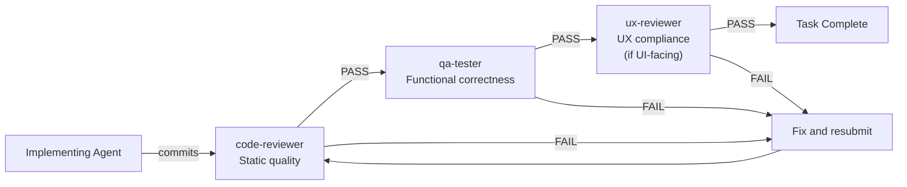

# The Agentic Development Team

**Date:** 2026-03-02

OrqaStudio™ uses an agentic development model: one orchestrator coordinates, and specialized subagents implement. This page defines the team structure, each agent's role, the skills available to them, and how review gates work.

---

## Team Model

| Role | Participant | Responsibilities |
|------|-------------|-----------------|
| **Product Manager** | User (human) | Defines vision, pillars, priorities. Approves feature scope. Makes decisions when product principles conflict. |
| **Tech Lead** | User (human) | Approves implementation plans before coding begins. Reviews architecture decisions. Provides technical oversight. Final authority on technical approach. |
| **Scrum Master / Dev Lead** | Orchestrator (Claude Code main session) | Reads TODO.md, creates worktrees, delegates to agents, gates on DoR/DoD, merges completed work, runs post-merge verification. |
| **Implementation Team** | Specialized agents | Implement delegated tasks end-to-end. Load skills. Run quality checks. Report results. |

The Product Manager and Tech Lead roles may be filled by the same person if they have the skillset. Both are human gates — no implementation proceeds without explicit user approval of the plan.

The orchestrator does NOT implement code directly. Its job is coordination, delegation, and gating. See [Orchestration](/process/orchestration) for the full orchestrator protocol.

---

## Agent Directory

All 15 agents are defined in `.orqa/agents/`. Each is invoked via the Task tool with `subagent_type`.

| Agent | Domain | Skills Loaded | Use When |
|-------|--------|---------------|----------|
| `backend-engineer` | Rust / Tauri v2 / IPC commands / domain logic / SQLite | chunkhound, rust-async-patterns, tauri-v2 | Creating or modifying Rust backend code, Tauri commands, database models |
| `frontend-engineer` | Svelte 5 / runes / shadcn-svelte / Tauri IPC client | chunkhound, svelte5-best-practices, typescript-advanced-types, tailwind-design-system | Creating or modifying Svelte components, stores, IPC wrappers |
| `designer` | shadcn-svelte / Tailwind CSS / design system | chunkhound, svelte5-best-practices, tailwind-design-system | Implementing UI components, styling, visual polish |
| `debugger` | Root cause analysis across Rust/Svelte boundary, IPC issues | chunkhound, rust-async-patterns, tauri-v2, svelte5-best-practices, typescript-advanced-types | Debugging test failures, tracing errors, IPC problems |
| `test-engineer` | cargo test / Vitest / Playwright E2E / TDD | chunkhound, rust-async-patterns, typescript-advanced-types | Writing tests, fixing failures, increasing coverage |
| `code-reviewer` | clippy pedantic / rustfmt / ESLint / svelte-check / zero-error policy | chunkhound, rust-async-patterns, svelte5-best-practices, typescript-advanced-types | Reviewing code, validating compliance with coding standards |
| `data-engineer` | SQLite schemas / rusqlite or sqlx / migrations | chunkhound, rust-async-patterns | Database models, repository adapters, schema migrations |
| `devops-engineer` | Tauri build pipeline / cross-platform packaging / CI/CD | chunkhound, tauri-v2 | Build configuration, platform-specific issues, CI pipeline |
| `documentation-writer` | Architecture decisions / IPC contracts / component specs | chunkhound, architecture | Creating or updating architecture docs, IPC contracts, component specs |
| `security-engineer` | API key management / file system permissions / Tauri security model | chunkhound, tauri-v2, rust-async-patterns | Auditing security, permissions, credential handling |
| `refactor-agent` | Architectural debt / module reorganization | chunkhound, rust-async-patterns, typescript-advanced-types | Decoupling, consolidation, eliminating architectural violations |
| `agent-maintainer` | Governance framework custodian / content-layer compliance | chunkhound, planning, skills-maintenance | Adding or modifying agents, auditing compliance, maintaining process docs |
| `systems-architect` | Architectural compliance during planning / cross-boundary analysis | chunkhound, architecture, planning, tauri-v2 | Planning features that cross the IPC boundary, evaluating architecture decisions |
| `qa-tester` | Functional QA / end-to-end user-perspective verification | chunkhound, svelte5-best-practices, typescript-advanced-types | Verifying completed features work end-to-end in the Tauri app |
| `ux-reviewer` | UX compliance / label audit / state audit / shared component audit | chunkhound, svelte5-best-practices, tailwind-design-system, typescript-advanced-types | Reviewing completed frontend features against docs/ui/ specs |

---

## Skill Directory

Skills are domain-specific instruction sets stored in `.orqa/skills/`. They follow the open [Agent Skills](https://agentskills.io) standard and must be portable -- no OrqaStudio-specific architectural rules in skills.

| Skill | Source | Domain | Loaded By |
|-------|--------|--------|-----------|
| `chunkhound` | Custom (Alvarez) | Semantic code search: search_regex, search_semantic, code_research | ALL agents |
| `planning` | Custom (Alvarez) | Discuss-Agree-Plan-Approve-Implement-Verify methodology | orchestrator, agent-maintainer, systems-architect |
| `skills-maintenance` | Custom (Alvarez) | skills.sh CLI, skill lifecycle, portability rules, audit protocol | agent-maintainer |
| `architecture` | Custom (Alvarez) | ADR pattern, data flow mapping, architectural violations | systems-architect, documentation-writer |
| `svelte5-best-practices` | skills.sh registry | Svelte 5 runes ($state, $derived, $effect), component patterns | frontend-engineer, designer, debugger, code-reviewer, qa-tester, ux-reviewer |
| `typescript-advanced-types` | skills.sh registry | Strict TypeScript, readonly types, string literal unions | frontend-engineer, debugger, code-reviewer, test-engineer, refactor-agent, qa-tester, ux-reviewer |
| `tailwind-design-system` | skills.sh registry | Tailwind CSS utilities, theme variables, design tokens | frontend-engineer, designer, ux-reviewer |
| `rust-async-patterns` | skills.sh registry | Rust async/await, tokio, error handling, lifetimes | backend-engineer, data-engineer, debugger, code-reviewer, test-engineer, security-engineer, refactor-agent |
| `tauri-v2` | skills.sh registry | Tauri v2 commands, Channel&lt;T&gt;, plugins, security model | backend-engineer, debugger, devops-engineer, security-engineer, systems-architect |

For full provenance and date-added information, see [Skills Log](/process/skills-log).

---

## Review Gates

Every task passes through independent review agents before it is marked complete. The implementing agent does not self-certify.

| Reviewer | Evaluates |
|----------|-----------|
| `code-reviewer` | clippy/rustfmt/ESLint/svelte-check zero errors; no stubs; 80%+ coverage; doc layer compliance; DoD code items |
| `qa-tester` | End-to-end functional correctness from a user perspective; smoke test; DoD smoke test items |
| `ux-reviewer` | Labels match docs/ui/ specs; all component states handled; shared components used; no jargon in UI; DoD UI items |

Review failures generate entries in [Implementation Lessons](/development/lessons). The agent-maintainer promotes recurring failures to rules or standards.

---

## Content Ownership

Each layer of the governance system owns a specific type of content. For the full framework, see [Content Governance](/process/content-governance). The `agent-maintainer` owns hookify rule files alongside lifecycle hooks.

| Layer | Owns |
|-------|------|
| `docs/` | Standards, IPC contracts, architecture decisions -- source of truth |
| `.orqa/agents/` | Process: how agents work, what to read, when to delegate |
| `.orqa/skills/` | Technology patterns -- portable, no OrqaStudio-specific rules |
| `.orqa/rules/` | Behavioral enforcement -- applies to all agents automatically |
| `.orqa/hooks/` | Lifecycle hooks -- shell scripts triggered by lifecycle events (session start, stop, pre-commit) |
| `.claude/hookify.*.local.md` | Hookify rules -- action-boundary enforcement that blocks or warns on specific patterns in file edits or bash commands |

---

## Related Documents

- [Orchestration](/process/orchestration) -- Orchestrator responsibilities and context discipline
- [Workflow](/process/workflow) -- Task lifecycle from start to complete
- [Content Governance](/process/content-governance) -- The six-layer ownership model
- [Skills Log](/process/skills-log) -- Full skill inventory with provenance and dates
- [Definition of Ready](/process/definition-of-ready) -- What must be true before implementation starts
- [Definition of Done](/process/definition-of-done) -- What must be true before a task is marked complete
