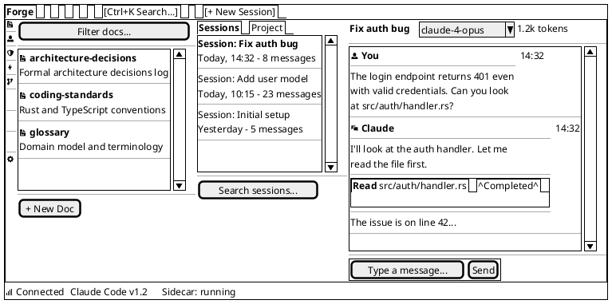
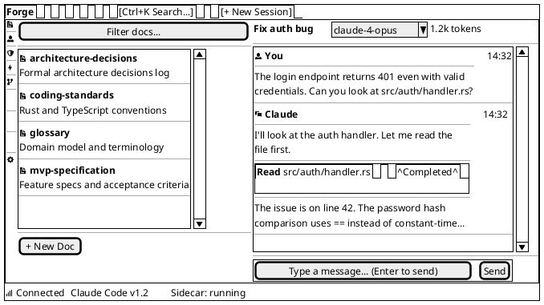
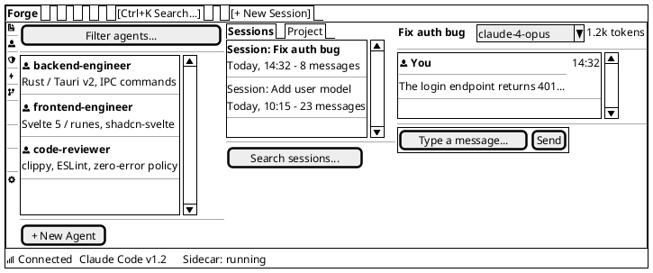
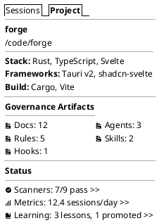

# Wireframe: Core Layout

**Date:** 2026-03-02 | **Informed by:** [Information Architecture](/product/information-architecture), [Frontend Research](/research/frontend), [Design System](/ui/design-system)

The main window structure showing all four zones: Activity Bar, Explorer Panel, Sessions Panel, and Chat Panel, plus Toolbar and Status Bar. This replaces the previous three-pane layout with a VS Code-style artifact-centric design.

---

## Default State (All Zones Open)

### Zone Dimensions

| Zone | Default | Min | Max | Collapsible |
|------|---------|-----|-----|-------------|
| Activity Bar | 48px (fixed) | 48px | 48px | No |
| Explorer Panel | Flex (fills remaining) | 280px | — | No |
| Sessions Panel | 240px | 180px | 320px | Yes (collapse to 0px) |
| Chat Panel | Flex (fills remaining) | 360px | — | No |
| Toolbar | Full width | — | — | No |
| Status Bar | Full width | — | — | No |

Explorer and Chat share remaining horizontal space approximately 50/50 after the Activity Bar (48px) and Sessions Panel (240px) are accounted for.

### Zone Relationship to PaneForge

The Activity Bar sits **outside** PaneForge as a fixed-width CSS flex element (48px). PaneForge manages the three resizable zones: Explorer Panel | Sessions Panel | Chat Panel.

---

## Sessions Panel Collapsed State

When the Sessions Panel is collapsed via `Ctrl+B`, its space redistributes to the Explorer and Chat panels.

---

## Activity Bar: Agents Selected

When the user clicks the Agents icon in the Activity Bar, the Explorer Panel switches to show the Agents artifact list.

---

## Sessions Panel: Project Tab

---

## Element Descriptions

### Toolbar

| Element | Behavior |
|---------|----------|
| **Project name** ("Forge") | Click opens project switcher dropdown. Shows current project name. |
| **Search** | `Ctrl+K` focuses. FTS5-powered search across sessions and artifacts. Results appear in Explorer Panel. |
| **New Session** | Creates a new conversation session and focuses the Chat Panel input. `Ctrl+N`. |

Note: The settings gear is removed from the toolbar. Settings is now accessible via the Activity Bar (bottom icon) or `Ctrl+,`.

### Activity Bar

| Element | Behavior |
|---------|----------|
| **Artifact category icons** | Docs (default), Agents, Rules, Skills, Hooks. Click switches the Explorer Panel to that category's artifact list. Active icon has a 2px left border indicator + highlighted background. The Hooks icon surfaces both lifecycle hooks (`.claude/hooks/`) and hookify enforcement rules (`.claude/hookify.*.local.md`). |
| **Dashboard icons** | Scanners, Metrics, Learning (Phase 3-5). Click switches the Explorer Panel to the corresponding dashboard. |
| **Settings icon** | Bottom-aligned. Click switches the Explorer Panel to the settings view. `Ctrl+,`. |
| **Tooltips** | Each icon shows a tooltip on hover with the zone name and keyboard shortcut. |
| **Keyboard shortcuts** | `Ctrl+1` through `Ctrl+5` for artifact categories. `Ctrl+Shift+S/M/L` for dashboards. `Ctrl+,` for settings. |

### Status Bar

| Element | Behavior |
|---------|----------|
| **Connection indicator** | Green dot = connected. Red dot = disconnected. Click to view connection details. |
| **Claude Code version** | Shows the detected CLI version. |
| **Sidecar status** | "running", "idle", "error". Shows current sidecar process state. |

### Resize Handles

PaneForge provides drag handles between the Explorer, Sessions, and Chat panes. Handles are 1px borders with an 8px invisible drag target. Double-click a handle to collapse/expand the Sessions Panel.

---

## Keyboard Navigation

| Shortcut | Action |
|----------|--------|
| `Ctrl+1` through `Ctrl+5` | Switch artifact category |
| `Ctrl+B` | Toggle Sessions Panel |
| `Ctrl+K` | Focus global search |
| `Ctrl+N` | New session |
| `Ctrl+,` | Open settings in Explorer Panel |
| `Tab` | Move focus between zones (Activity Bar > Explorer > Sessions > Chat) |
